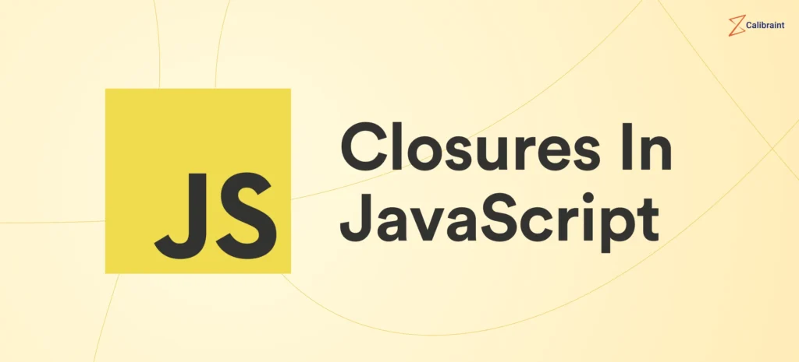

# 📚 JavaScript Advanced



An advanced JavaScript project from Holberton School focused on mastering **closures**, **lexical scoping**, **execution stack**, **callbacks**, **DOM manipulation**, and **function binding**. This project is a deep dive into powerful JavaScript concepts using only **vanilla JS**.

---

## 📝 Description

This repository contains multiple scripts that demonstrate core advanced JavaScript principles. Each task builds upon the previous one to reinforce real-world application of closures, binding, callback functions, and more.

---

## 🎯 Learning Objectives

By the end of this project, you should be able to:

- Understand lexical scoping in JavaScript
- Create and chain closures effectively
- Simulate private methods using closures
- Master JavaScript's execution stack
- Implement and use function binding
- Apply callbacks in asynchronous code
- Manipulate the DOM with closures

---

## 📦 Requirements

- **Editor**: `vi`, `vim`, `emacs`, `Visual Studio Code`
- All files end with a **new line**
- File extension: `.js`
- A `README.md` file at the root is mandatory
- No external libraries (jQuery, etc.)

---

## 📁 Project Structure


## 🔧 How to Run

1. Clone the repo:

   git clone https://github.com/khezamiTaha/holbertonschool-web_front_end.git

    cd holbertonschool-web_front_end/Javascript_advanced


2. Open the files in your browser or browser console to test scripts.

3. Example test:

   ```js
   welcome('Holberton', 'School');
   ```

---

## 🛠 Resources

* [Lexical scoping](https://developer.mozilla.org/en-US/docs/Web/JavaScript/Closures#lexical_scoping)
* [Closures](https://developer.mozilla.org/en-US/docs/Web/JavaScript/Closures)
* [Call stack](https://developer.mozilla.org/en-US/docs/Glossary/Call_stack)
* [Binding](https://developer.mozilla.org/en-US/docs/Web/JavaScript/Reference/Global_objects/Function/bind)
* [Callbacks](https://developer.mozilla.org/en-US/docs/Glossary/Callback_function)

---

## 👨‍🏫 Author

Project developed for the **Holberton School Web Front End curriculum**.

---

## 🎓 Credits

All tasks and guidelines were provided by [Holberton School](https://www.holbertonschool.com/).

---

